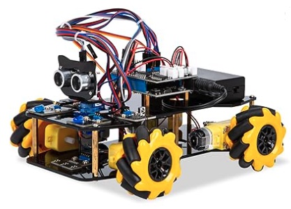
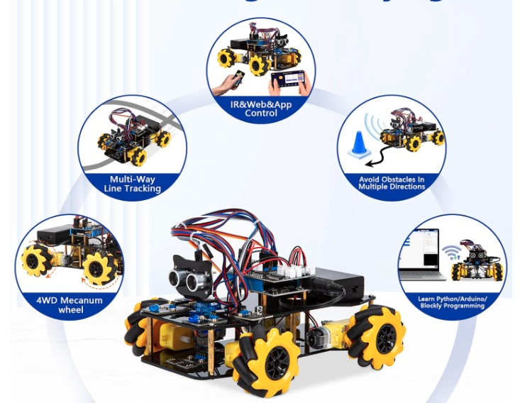
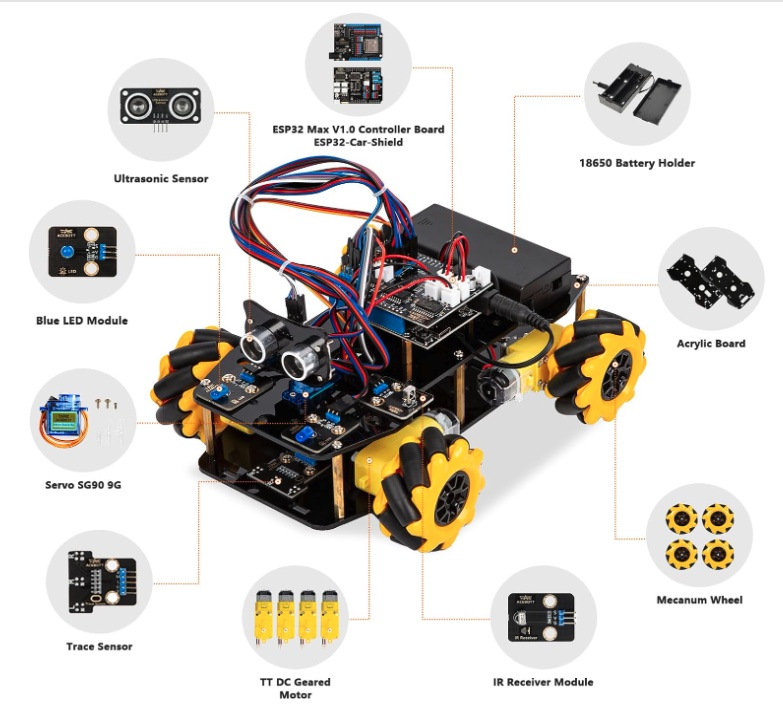

# 🤖 How the ACEBOTT-Robot Works

[← Back to Main Project Page](../README.md)

  
   
  <i>The ACEBOTT chassis featuring 4WD Mecanum wheels and the ESP32 brain.</i>

This document explains the logic, priorities, and control systems that make the robot move and react to its environment.

---

## 🚦 Control Priorities & Functions
The ESP32 "Brain" follows a strict hierarchy. If two commands happen at once, the one with the **lower Priority Number** wins to ensure safety.

  

| Priority | System | Logic Explanation |
| :--- | :--- | :--- |
| **1 (Highest)** | **Obstacle Avoidance** | Uses the **Ultrasonic sensor** (the "eyes"). If an object is within 15cm, the code ignores your "Forward" command and stops to prevent a crash. |
| **2** | **Line Following** | Uses the **Bottom Trace Sensors**. It looks for the contrast between a dark line and a light floor to steer automatically. |
| **3 (Lowest)** | **Manual Control** | Commands sent via the **Web Dashboard** or **IR Remote**. These only work if Priority 1 and 2 are clear. |

---

## 🛠️ Hardware Components
Understanding the wiring is key to troubleshooting the robot's movement.

  

* **ESP32 Max V1.0:** The controller that hosts the Web Server and processes IR signals.
* **L298N H-Bridge:** Located under the shield; it converts the ESP32's tiny logic signals into the high-current power needed to turn the motors.
* **Mecanum Wheels:** These specialized wheels allow the car to move sideways (strafing) by spinning pairs of wheels in opposite directions.

---

## 🏎️ IR Remote & Speed Control
The Infrared (IR) Remote uses **Pulse Width Modulation (PWM)**.

* **Acceleration (Up Arrow):** We don't just jump to full speed. The code ramps up power in 10% increments for a smooth take-off.
* **Deceleration (Down Arrow):** Reduces the "Duty Cycle" to slow the motors down without a jerky stop.
* **Emergency Stop (OK Button):** A dedicated interrupt that cuts motor power to zero immediately.
---
**Ready to start?** Return to the [Main README](../README.md) for installation instructions.